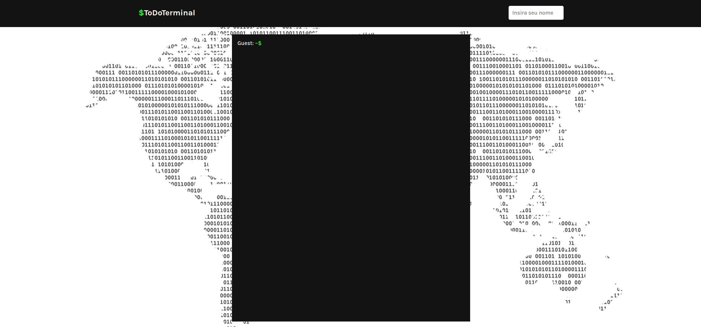

<h1 align="center">To Do Terminal</h1>

  

O projeto consiste em uma lista de tarefas feita em ReactJS, no estilo de terminal. Contém várias funcionalidades de uma lista de tarefas, como adicionar, remover, listar tarefas, entre outras.

